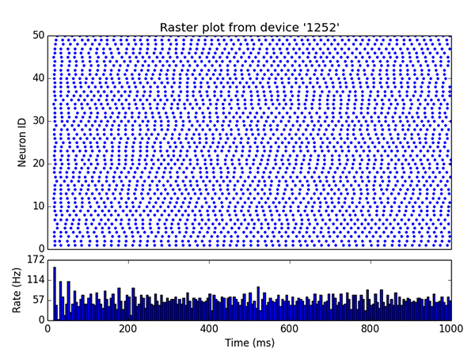
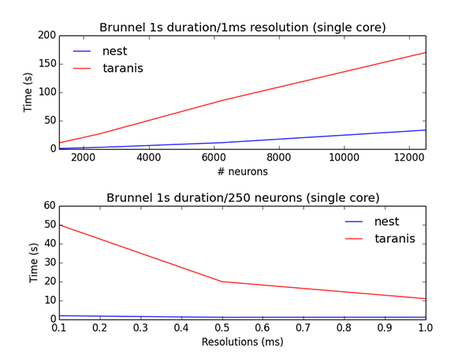

## Taranis

This is a short-project aiming to evaluate how [Akka](http://akka.io) behave for simulating neural networks with spike-timing dependent plasticity (STDP).
It is strongly inspired by the Neural Simulation Tool ([NEST](https://github.com/nest/nest-simulator)) and the STDP [module](https://github.com/zifeo/nest-stdpmodule).
Due to the very short delays, code was only tested visually and is missing a clear structure as well as comments.
There is also plenty of opportunities to investigate alternative system design in order to improve performance.

### Examples

The small differences come from the fact the delay is not managed the same way and that the sample population (in the Brunnel balanced network) is also not the same.

NEST:

Taranis:

### Performance

After some light and fast-profiling, it seems that JVM garbage collector is tough to overcome.

### License

The code is available under Apache license 2.0. See `LICENSE` for further details.

### Reference

- Eppler, Jochen Martin et al.. (2015). NEST 2.8.0.
